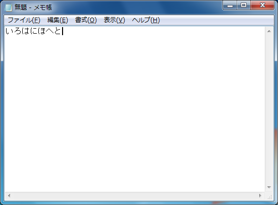
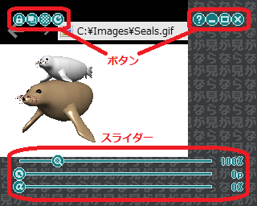
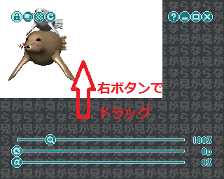
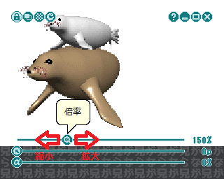
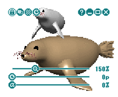
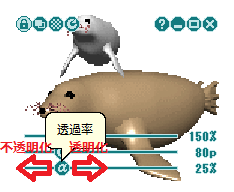
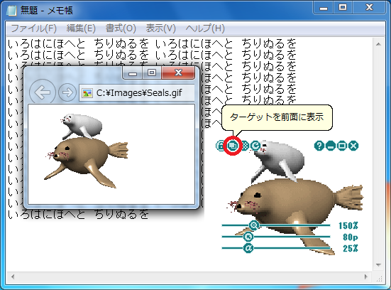
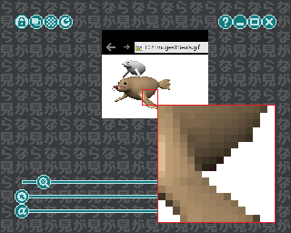
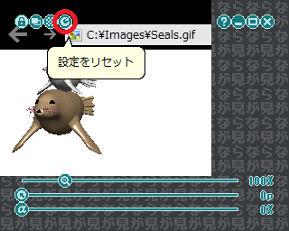
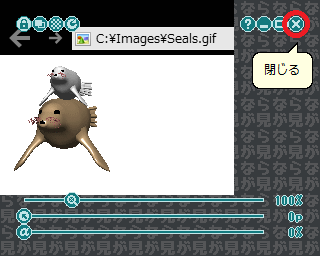

# Nagaramiユーティリティ
Nagaramiは何か作業をしながら他のウィンドウをながら見するための
ユーティリティです。  
例えば資料を作りながらアニメをながら見したり、
ゲームをしながら実況動画をながら見するのを補助してくれます。  

## 使い方
メモ帳で文章を書いているときに、  
  
ブラウザで表示しているGIFアニメをながら見したくなったとします。  
  

### 起動
Nagarami.exeを実行すると、ウィンドウが表示されます。  
  
このウィンドウにGIFアニメを表示しているブラウザの内容を表示します。  
ながら見の対象となるウィンドウを「ターゲット」と呼びます。  

### ターゲットの選択とロック
ブラウザをアクティブにすると、Nagaramiにブラウザの内容が表示されます。  
  
これでブラウザがターゲットとして選択されました。  

Ctrlキーを押すと、上にボタン、下にスライダーが表示されて、
Nagaramiを操作できるようになります。  
  
この状態を「コントロールモード」と呼びます。  
Nagaramiを操作するときは必ずコントロールモードにします。  

一番左にあるボタン（南京錠のアイコン）をクリックすると、
ターゲットがロックされます。  
  
これでブラウザ以外のウィンドウをアクティブにしても、
ターゲットが移らないようになりました。  

### 表示したい領域と倍率の設定
ウィンドウをマウスの右ボタンでドラッグすると、
表示内容をスライドできます。  
  
ブラウザのキャプション部分をカットしました。  

一番上にあるスライダー（虫眼鏡のアイコン）を操作すると、
表示内容を拡大または縮小できます。  
  
1.5倍に拡大しました。  

ウィンドウの端にカーソルを合わせて、マウスの左ボタンでドラッグすると、
ウィンドウのサイズを変更できます。  
  
不要な部分をカットしました。  

### ながら見
ウィンドウをマウスの左ボタンでドラッグすると、ウィンドウを移動できます。  
  
Nagaramiは最前面に表示されるので、
メモ帳をアクティブにしても背後に隠れません。  

コントロールモードを解除すると、カーソルの周囲に透明な穴が開きます。  
  
穴の上でマウスを操作すると、その入力は下のメモ帳に伝わります。  

上から二番目にあるスライダー（αのアイコン）を操作すると、
ウィンドウを透明または不透明にできます。  
  
下の文章が見えるように25%だけ透明にしました。  

これでメモ帳に文章を書きながら、
できるだけ邪魔にならないような形で、
GIFアニメをながら見できるようになりました。  
  

## その他

### 穴の大きさ
一番下にあるスライダー（穴に矢印のアイコン）を操作すると、
カーソルの周囲に開く穴の大きさを調整できます。  
  
Nagaramiの下をあまり操作しないなら、穴は小さいほうがよいでしょう。  

### ターゲットを前面に表示
左から二番目にあるボタン（ウィンドウが前面にあるアイコン）
をクリックすると、ターゲットを前面に表示できます。  
  
ながら見している動画を一時停止したり、別の動画に移るときに便利です。  

### 高画質モード
縮小するとピクセルが潰れてしまうことがあります。  
  
左から三番目にあるボタン（トーンのアイコン）をクリックすると、
高画質モードにできます。  
  
ただし高画質モードはCPUに対する負荷が高いので、
必要に応じて使用してください。  

### 設定のリセット
左から四番目にあるボタン（矢印が回転しているアイコン）をクリックすると、
表示領域、倍率、透過率、穴の大きさ、高画質モードがリセットされます。  
  
ターゲットを別のウィンドウに変えるときに便利です。  

### 終了、最大化、最小化、ヘルプ
一番右にあるボタンをクリックすると、Nagaramiを終了します。  
右から二番目にあるボタンをクリックすると、ウィンドウを最大化します。  
右から三番目にあるボタンをクリックすると、ウィンドウを最小化します。  
右から四番目にあるボタンをクリックすると、README.mdのURLを開きます。  
  

### 設定のセーブとロード
設定は終了時に作業ディレクトリのNagarami.psに自動的にセーブされます。  
起動時にNagarami.psがあれば自動的にロードされて、
前回の設定を引き継ぎます。  

## 最後に
### ライセンス
NagaramiはMITライセンスに従います。  
ライセンスの範囲内であればコピー、変更、配布は自由です。  

### フィードバック
もしバグ、不具合、改善要望などがありましたら
[Gonbee2017](<mailto:gonbee2017@outlook.jp>)までメールをください。  
できる限り対応させていただきます。  
