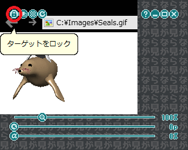
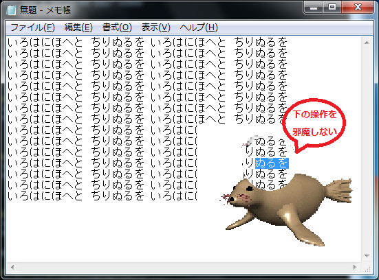

# Nagaramiユーティリティ
Nagaramiは何か作業をしながら他のウィンドウをながら見するための
ユーティリティです。  
例えば資料を作りながらアニメをながら見したり、
ゲームをしながら実況動画をながら見するのを補助してくれます。  

[1 使い方](#1)  
[1-1 起動](#1-1)  
[1-2 ターゲットの選択とロック](#1-2)  
[1-3 表示したい領域と倍率の設定](#1-3)  
[2 その他](#2)  
[2-1 ターゲットを前面に表示](#2-1)  
[2-2 高画質モード](#2-2)  
[2-3 設定のリセット](#2-3)  
[2-4 終了、最大化、最小化、ヘルプ](#2-4)  
[3 最後に](#3)  
[3-1 ライセンス](#3-1)  
[3-2 フィードバック](#3-2)  

## <a name="1">1 使い方</a>
メモ帳に文章を書いているときに、  
  
ブラウザに表示しているGIFアニメをながら見したくなったとします。  
  

### <a name="1-1">1-1 起動</a>
Nagarami.exeを実行すると、ウィンドウが表示されます。  
  
このウィンドウにGIFアニメを表示しているブラウザの内容を表示します。  
ながら見の対象となるウィンドウを「ターゲット」と呼びます。  

### <a name="1-2">1-2 ターゲットの選択とロック</a>
ブラウザをアクティブにすると、Nagaramiにブラウザの内容が表示されます。  
  
これでブラウザがターゲットとして選択されました。  

Ctrlキーを押すと、上にボタン、下にスライダーが表示されて、
操作できるようになります。  
  
この状態を「コントロールモード」と呼びます。  
ボタンとスライダーを操作するときは必ずコントロールモードにします。  

一番左にあるボタン（南京錠のアイコン）をクリックすると、
ターゲットがロックされます。  
  
これでブラウザ以外のウィンドウをアクティブにしても、
ターゲットが移らないようになりました。  

### <a name="1-3">1-3 表示したい領域と倍率の設定</a>
ウィンドウをマウスの右ボタンでドラッグすると、
表示内容をスライドできます。  
  
ブラウザのキャプション部分をカットしました。  

一番上にあるスライダー（虫眼鏡のアイコン）を操作すると、
表示内容を拡大または縮小できます。  
  
1.5倍に拡大しました。  
倍率はマウスホイールで変更することもできます。  

ウィンドウの端にカーソルを合わせて、マウスの左ボタンでドラッグすると、
ウィンドウのサイズを変更できます。  
  
不要な部分をカットしました。  

### <a name="1-4">1-4 穴のサイズと透過率の設定</a>
ウィンドウをマウスの左ボタンでドラッグすると、ウィンドウを移動できます。  
  
Nagaramiは最前面に表示されるので、
メモ帳をアクティブにしても背後に隠れません。  

上から二番目のスライダー（穴の中に矢印のアイコン）を操作すると、
穴のサイズを広げる、または狭めることができます。  
  
Ctrlキーを離して、コントロールモードを解除すると、
カーソルの周囲に穴が開きます。  
  
穴の上でマウスを操作すると、その入力は下のメモ帳に伝わります。  

上から三番目にあるスライダー（αのアイコン）を操作すると、
ウィンドウを透明または不透明にできます。  
  
下の文章が見えるように25%だけ透明にします。  

これでメモ帳に文章を書きながら、できるだけその邪魔にならないように、
GIFアニメをながら見できるようになりました。  
  

## <a name="2">2 その他</a>

### <a name="2-1">2-1 ターゲットを前面に表示</a>
左から二番目にあるボタン（ウィンドウが前面にあるアイコン）
をクリックすると、ターゲットを前面に表示できます。  
  
ながら見している動画を一時停止したり、別の動画に移るときに便利です。  

### <a name="2-2">2-2 高画質モード</a>
縮小するとピクセルが潰れてしまうことがあります。  
  
左から三番目にあるボタン（トーンのアイコン）をクリックすると、
高画質モードにできます。  
  
ただし高画質モードはCPUに対する負荷が高いので、
必要に応じて使用してください。  

### <a name="2-3">2-3 設定のリセット</a>
左から四番目にあるボタン（矢印が回転しているアイコン）をクリックすると、
表示内容の位置、倍率、穴のサイズ、透過率、
高画質モードがリセットされます。  
  
ターゲットを別のウィンドウに変えるときに便利です。  

### <a name="2-4">2-4 終了、最大化、最小化、ヘルプ</a>
一番右にあるボタンをクリックすると、Nagaramiを終了します。  
  
右から二番目にあるボタンをクリックすると、ウィンドウを最大化します。  
  
右から三番目にあるボタンをクリックすると、ウィンドウを最小化します。  
  
右から四番目にあるボタンをクリックすると、README.mdのURLを開きます。  
  

### <a name="2-5">2-5 設定のセーブとロード</a>
設定は終了時に作業ディレクトリのNagarami.psに自動的にセーブされます。  
起動時にNagarami.psがあれば自動的にロードされて、
前回の設定を引き継ぎます。  

## <a name="3">3 最後に</a>

### <a name="3-1">3-1 ライセンス</a>
NagaramiはMITライセンスです。  
基本的にコピー、変更、配布は自由です。  

### <a name="3-2">3-2 フィードバック</a>
もしバグ、不具合、改善要望などがありましたら
[Gonbee](<mailto:gonbee2017@outlook.jp>)までメールをください。  
できる限り対応させていただきます。  
